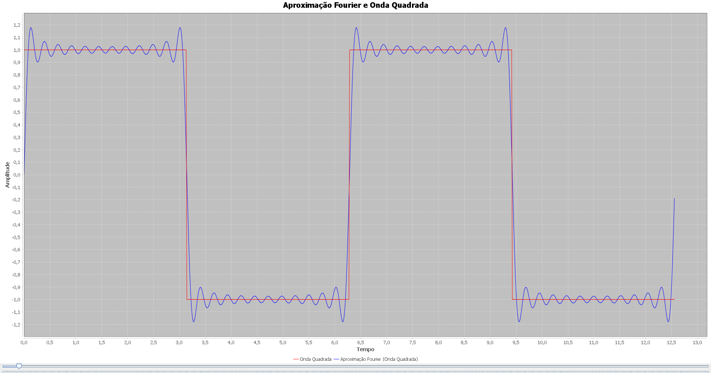

# Transformada de Fourier

<p align="center">
    
</p>

Este projeto demonstra como uma soma de uma senoide fundamental com suas hármonicas se transforma numa onda quadrada.

## Funcionalidades

- Gera uma onda quadrada para servir de referencia visual
- Aplica a transformada de Fourier a uma senoide funadental

## Requisitos
- Java 17 ou +

## Executando o Projeto

- Para executar o arquivo .jar, acesse o cmd e navegue até o diretório onde se encontra o arquivo "TransformadaFourier.jar"

- Em seguida execute o seguinte comando:

```
    java -jav TransformadaFourier.jar
```

## Licença

Este projeto está licenciado sob a Licença MIT.

## Contato

Para mais informações, entre em contato com guilherme.chaves66@gmail.com
